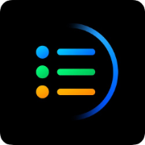
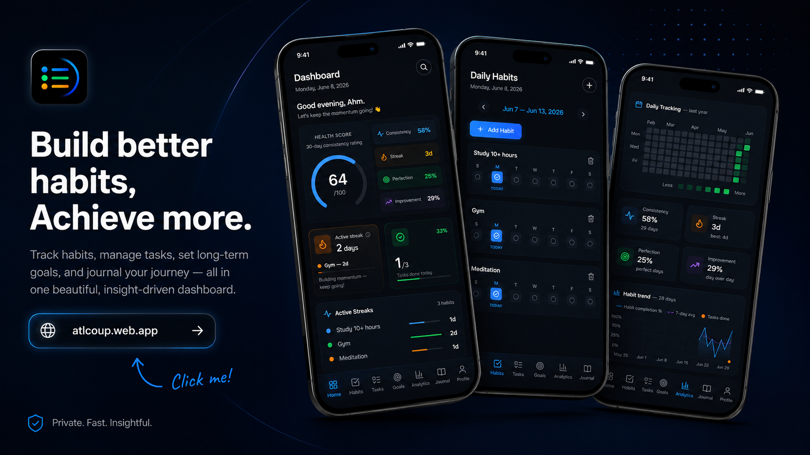

<div align="center">



# Atlas Coup

**Build better habits. Achieve more.**

Free, full-stack personal productivity - Habits · Tasks · Goals · Journal · Analytics · Dashboard

</br>

[](https://atlcoup.web.app)

</br>



</div>

---

## What is Atlas Coup?

Atlas Coup is a full-stack personal productivity platform. Sign in once — and get a unified dashboard for tracking habits, managing tasks, setting goals, journalling daily, and visualising your progress over time. No subscriptions, no clutter. Just you and your data.

It uses **Firebase Authentication** for secure sign-in, **Firestore** as the real-time database, and a polished **React + Vite** frontend with smooth Framer Motion animations and a dark-first UI.

---

## Features

- **Habit Tracker** — build streaks, track consistency over time
- **Task Manager** — create, organise, and complete daily tasks
- **Goal Setting** — define long-term goals and track progress
- **Journal** — write daily entries and reflect on your journey
- **Analytics Dashboard** — visualise your productivity trends
- **User Dashboard** — personalised overview of everything at a glance
- **Smooth Animations** — Framer Motion transitions throughout
- **Dark-first UI** — deep `#050811` background, Quicksand typeface
- Zero ads · Zero tracking · Zero paywalls

---

## Tech Stack

### Frontend

| Technology | Version | Purpose |
|---|---|---|
| [React](https://react.dev) | `^18.3.1` | UI framework |
| [Vite](https://vitejs.dev) | `^5.3.1` | Build tool & dev server |
| [TypeScript](https://tailwindcss.com) | — | — |
| [Tailwind CSS](https://tailwindcss.com) | `^3.4.4` | Utility-first styling |
| [Framer Motion](https://www.framer.com/motion) | `^10.18.0` | Animations & transitions |
| [React Router DOM](https://reactrouter.com) | `^6.23.1` | Client-side routing |
| [Lucide React](https://lucide.dev) | `^0.381.0` | Icon library |
| [Zustand](https://zustand-demo.pmnd.rs) | `^4.5.2` | Lightweight state management |
| [date-fns](https://date-fns.org) | `^3.6.0` | Date formatting & utilities |
| [clsx](https://github.com/lukeed/clsx) + [tailwind-merge](https://github.com/dcastil/tailwind-merge) | — | Conditional class merging |

### Backend & Infrastructure

| Technology | Version | Purpose |
|---|---|---|
| [Firebase Auth](https://firebase.google.com/products/auth) | `^10.12.0` | User authentication |
| [Firestore](https://firebase.google.com/products/firestore) | `^10.12.0` | Real-time NoSQL database |
| [Firebase Hosting](https://firebase.google.com/products/hosting) | — | Production deployment |


---

## Getting Started

### Prerequisites

- Node.js `18.x` or higher
- npm / yarn / pnpm
- A Firebase project (free Spark plan works)

### Installation

```bash
# Clone the repo
git clone https://github.com/code2ahm/atlascoup.git
cd atlascoup

# Install dependencies
npm install
```

### Firebase Setup

1. Go to [console.firebase.google.com](https://console.firebase.google.com) and create a project
2. Enable **Authentication** (Email/Password or Google)
3. Enable **Firestore Database** (start in test mode)
4. Copy your Firebase config into `src/lib/firebase.js`:

```js
const firebaseConfig = {
  apiKey: "YOUR_API_KEY",
  authDomain: "YOUR_PROJECT.firebaseapp.com",
  projectId: "YOUR_PROJECT_ID",
  storageBucket: "YOUR_PROJECT.appspot.com",
  messagingSenderId: "YOUR_SENDER_ID",
  appId: "YOUR_APP_ID"
};
```

### Development

```bash
npm run dev
```

Open [http://localhost:5173](http://localhost:5173).

### Production Build

```bash
npm run build
npm run preview
```

---

## Deployment

### Firebase Hosting (recommended)

```bash
# Install Firebase CLI
npm install -g firebase-tools

# Login and initialise
firebase login
firebase init hosting

# Deploy
npm run build
firebase deploy
```

> The project already includes `.firebaserc` and `firebase.json` — just connect your Firebase project ID and deploy.

### Vercel / Netlify

Since Atlas Coup is a pure client-side Vite app, it deploys to any static host:

```bash
npm run build
# Upload the `dist/` folder to any static host
```

---

## Roadmap

- [ ] Pomodoro timer integrated with tasks
- [ ] Habit streak heatmap (GitHub-style)
- [ ] Goal milestones & sub-goals
- [ ] Journal mood tagging & sentiment trends
- [ ] Export data to JSON / CSV
- [ ] PWA support for offline use
- [ ] Dark / light theme toggle

---

## Contributing

Pull requests are welcome. For major changes, open an issue first.

```bash
# Fork and clone
git clone https://github.com/your-username/atlascoup.git
cd atlascoup

# Create a feature branch
git checkout -b feat/your-feature

# Make changes, then
npm run build

# Push and open a PR
git push origin feat/your-feature
```

---

<div align="center">

Built with [React](https://react.dev) · [Firebase](https://firebase.google.com) · [Vite](https://vitejs.dev) · [Tailwind CSS](https://tailwindcss.com)

**[atlcoup.web.app](https://atlcoup.web.app)**

</div>
